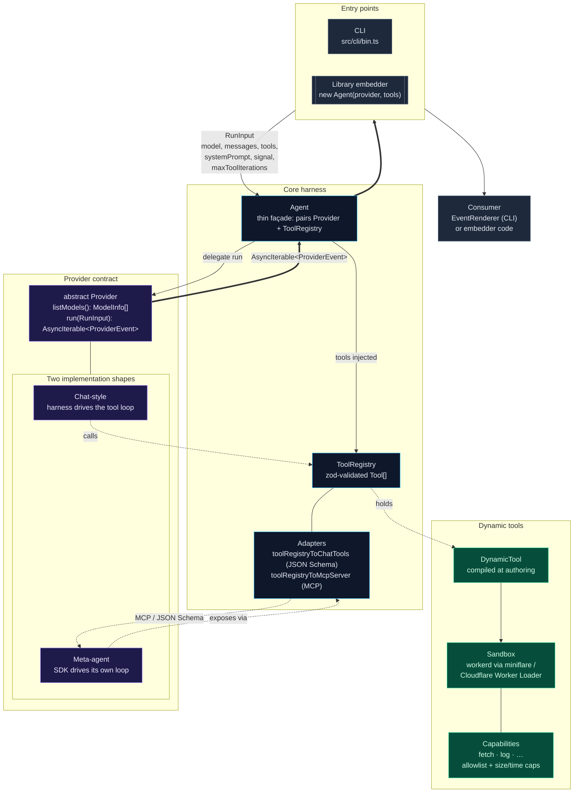
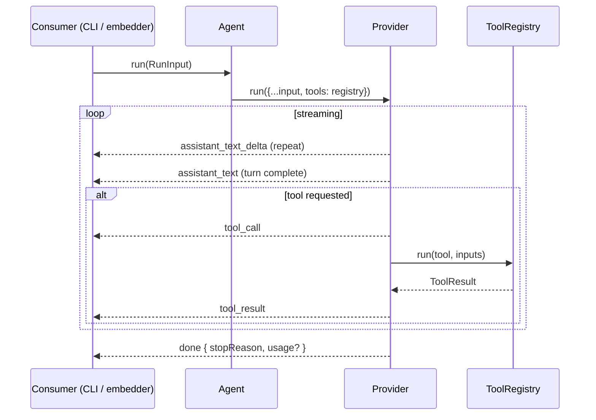
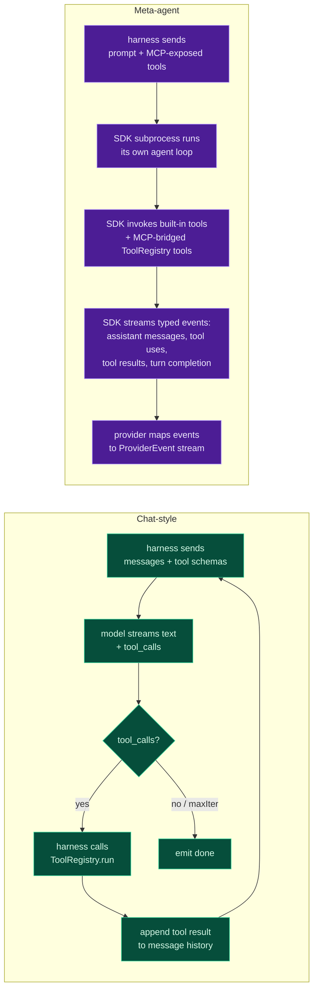

# Architecture

How the ambient-agent harness composes a turn: from `RunInput` → `Provider` → `AsyncIterable<ProviderEvent>` → renderer.

## Event stream

Every provider produces the same normalized events, so the consumer (CLI renderer, embedder loop, logger) doesn't need to know the backend.

Events:

| event                    | emitted when                                        |
| ------------------------ | --------------------------------------------------- |
| `assistant_text_delta`   | streaming token / chunk from the model              |
| `assistant_text`         | a complete assistant message after streaming closes |
| `tool_call`              | model asked for a tool (normalized shape)           |
| `tool_result`            | tool finished (`ToolResult<unknown>` from registry) |
| `done`                   | turn ended — `stop`, `tool_limit`, `length`, `aborted` |
| `error`                  | provider-level failure (`ProviderError` variant)    |

## Chat-style vs meta-agent providers

The two shapes differ in **who runs the tool loop** — everything else is identical from the consumer's point of view.

**Chat-style**: the harness is the agent. The provider sends `messages + tools` to the model, intercepts tool calls, dispatches them through `ToolRegistry`, and feeds results back. `maxToolIterations` caps the loop.

**Meta-agent**: the SDK is the agent. It has its own agent loop, its own built-in tools (filesystem, shell, etc.), and its own subprocess. The harness just hands it a prompt and mirrors the SDK's typed event stream back to the consumer. Our `ToolRegistry` is bridged in through MCP so the SDK's agent can also call our tools.

## Why this split matters

- **Consumers stay simple**: the `EventRenderer` (or any embedder loop) reads one event type and doesn't care whether we're talking to a local Ollama server, a cloud API, or a full coding-agent CLI subprocess.
- **Swappable backends**: the CLI's `--provider` flag picks at runtime. The `Agent` class is identical for all of them.
- **Tools work everywhere**: register a `Tool` once; it's exposed as JSON-Schema function-calling for chat-style providers and as an in-process MCP server for meta-agent providers — same `ToolRegistry`, same `run()` path.
- **Sandbox where it matters**: tools whose code you don't trust go through `DynamicTool` → workerd, with capability-gated host access. The provider layer is unaware.
